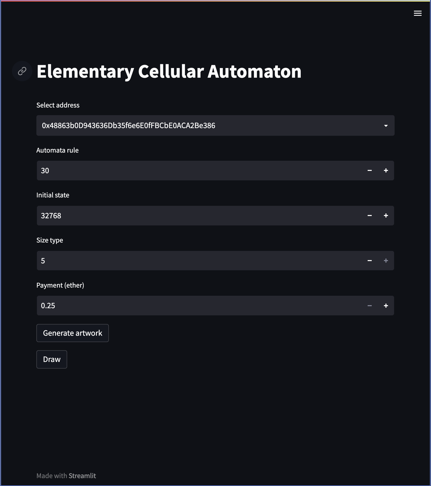

# Elementary Cellular Automata (ECA) NFT

Inspired by [Autoglyphs](https://www.larvalabs.com/autoglyphs), the ECA NFT project combines the purity of on-chain artwork with the beauty of [elementary cellular automata](https://en.wikipedia.org/wiki/Elementary_cellular_automaton).

## Background
ECA is a one-dimensional cellular automaton, where cells that can be in a "dead" or "alive" state live on a line. The next generation of these cells are determined by a rule which determine a cell's fate based on its state and its neighbors'.

## Parameters

Each art piece is generated dynamically based on three parameters:
- rule
- state
- size type

### Rule
Rule is a 8 bit parameter with valid values between 0 and 255. For any given cell, there are possible 8 configurations of states between itself and two neighbors. Each of these 8 possible configurations map to a specific bit in the rule. If the corresponding bit in the rule is a 1, then that means that cell's next generation state is "alive", otherwise "dead".

### State
State encodes bit by bit the "dead" (0) or "alive" (1) initial state. The number of bits used in the state depends on size type.

### Size Type
Size type ranges from 1 to 5. The number of bits of state used is `1 << SizeType - 1`. This also determines how many generations are calculated for the artwork. Each artwork is square in shape.

| Size Type | Side Size |
| :-------: | :-------: |
|     1     |     1     |
|     2     |     3     |
|     3     |     7     |
|     4     |    15     |
|     5     |    31     |

## Examples
rule=30, state=8, size type=3
```
...+...
..+++..
.++..+.
++.++++
...+...
..+++..
.++..+.
```

rule=105, state=143341353, size type=5
```
+..+.+..+++.++..++.+...+...+...
....+...+.++++..+++..+...+...+.
+++...+..++..+..+.+....+...+...
+.+.+....++......+..++...+...+.
.+.+..++.++.++++....++.+...+..+
+.+...+++++++..+.++.+++..+.....
.+..+.+.....+...+++++.+....+++.
.....+..+++...+.+...++..++.+.+.
++++....+.+.+..+..+.++..+++.+..
+..+.++..+.+.......+++..+.++...
....+++...+..+++++.+.+...+++.+.
+++.+.+.+....+...++.+..+.+.++..
+.++.+.+..++...+.+++....+.+++..
.++++.+...++.+..++.+.++..++.+..
.+..++..+.+++...+++.+++..+++..+
+...++...++.+.+.+.+++.+..+.+...
..+.++.+.+++.+.+.++.++....+..+.
+..++++.++.++.+.++++++.++......
...+..++++++++.++....++++.++++.
++....+......++++.++.+..+++..+.
++.++...++++.+..+++++...+.+...+
.++++.+.+..++...+...+.+..+..+.+
++..++.+...++.+...+..+.......+.
++..+++..+.+++..+......+++++..+
.+..+.+...++.+....++++.+...+..+
+....+..+.+++..++.+..++..+.....
..++.....++.+..+++...++....+++.
+.++.+++.+++...+.+.+.++.++.+.+.
.+++++.+++.+.+..+.+.+++++++.+.+
++...+++.++.+....+.++.....++.+.
++.+.+.+++++..++..+++.+++.+++.+
```

## Font

[automaton.ttf](font/automaton.ttf) encodes the `.` (dead) and `+` (alive) ASCII representations into a white and black boxes to make the art look pretty!


[example_automaton.html](examples/example_automaton.html)

## Usage

### Python Prerequisites
- web3
- python-dotenv
- streamlit
- jinja2

### Deploy Contract
1. Compile [contracts/automaton.sol](contracts/automaton.sol) with solidity version 0.8.12
2. Deploy to chain of choice

### Run Frontend
1. Populate a `.env` file with `WEB_PROVIDER_URI` pointing to the web3 provider and hex formatted contract address `CONTRACT_ADDRESS`
2. `streamlit run app.py`

3. Choose automata parameters rule, initial state, size type
4. Click "Generate artwork" and wait for transaction completion
5. Click "Draw"
6. Open [automaton.html](automaton.html) in browser - this file is overwritten on Draw
